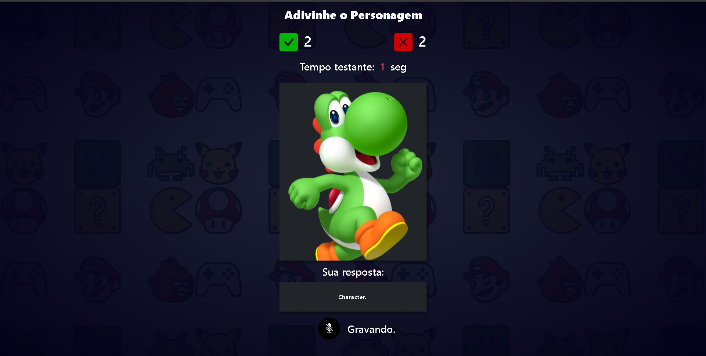

:joystick: <h1>Adivinhe o Personagem</h1>
Um simples jogo de adivinhação desenvolvido em javascript utilizando API do navegador para reconhecimento de voz.
Este jogo faz uso da API do navegador <a href="https://developer.mozilla.org/en-US/docs/Web/API/Web_Speech_API/Using_the_Web_Speech_API">webkitSpeechRecognition</a>, capaz de transcrever áudio do microfone em texto.
A compatibilidade com todos os navegadores não é garantida, mas testei no Microsoft Edge e funcionou bem.

<h1>Screenshots</h1>

